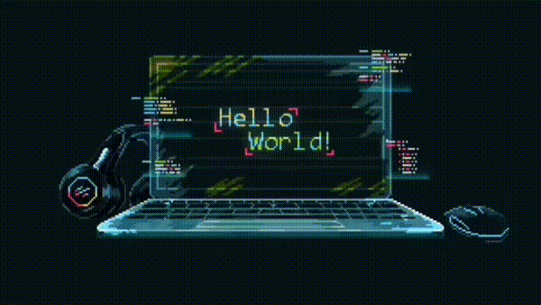

  
    
  

### 👨‍💻 About Me

- 🔭 I’m currently working on **Awesome Projects**
- 📫 How to reach me: **ssenkrad14@gmail.com**
- **Don't Forget:Never Refuse Coffee and Coding Together**

---

### 🚀 Tech Stack & Tools

  
  
  
  
  
  
  
  
  
  

---

  <i>"Code is like humor. When you have to explain it, it’s bad." – Cory House</i>

